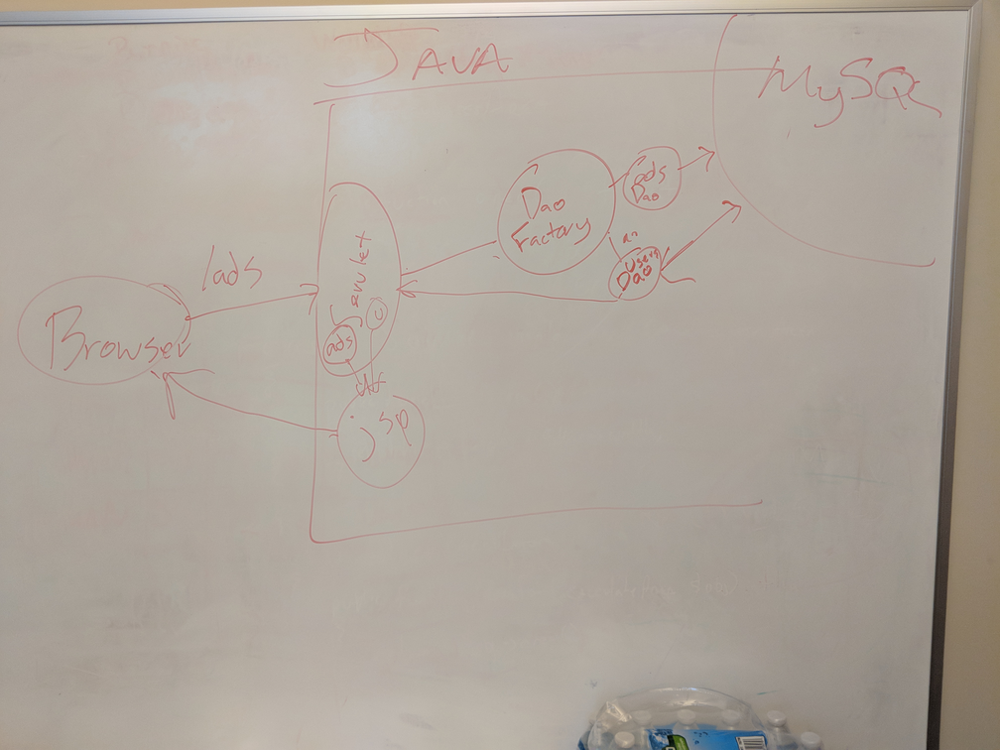

# Study Hall

Whiteboard Diagram:



## Servlet Lingo

- servlets are the middleman

- needs to talk to the database
- servlet talks to the database through a **dao** (data access object)
- servlet interacts with daos through the dao **factory**
    - we can think of the factory as the middleman between the servlets and the daos

### What a servlet does

in broad term

- doGet

    1. (optionally) collect some data
    2. pass everything off to a jsp (including any data necessary)

- doPost

    1. Collect submitted information (data from an html form that the user typed in)
    2. (optionally) do something with that data (validation)
    3. take the submitted information and use it to talk to the database
        1. Creating a user model with the submitted information
        2. passing that user object to the dao to be persisted to the database
    4. Redirect somewhere

## Statements vs Prepared Statement

- **Use prepared statements**
- to protect against SQL injection

- statements send "raw" strings to the database
- prepared statements have placeholders and properly deal with user input

## ResultSets

- multiple results that we want to look at -- `while(rs.next())`
- just one result
    - `if (rs.next())` --- explicit error handing
    - `rs.next()` just by itself --- handle errors through exceptions

## SQL Injection

- Search form for ads, somewhere on the backend

```sql
SELECT * FROM ads WHERE title LIKE '%?%';
```

- where `?` is whatever the user typed in

- user input: cute puppies

```sql
SELECT * FROM ads WHERE title LIKE '%cute puppies%';
```

- user input: cute puppies'

```sql
SELECT * FROM ads WHERE title LIKE '%cute puppies'%';
```

- ^ that's a SQL syntax error
- to actually search for `cute puppies'`

```sql
SELECT * FROM ads WHERE title LIKE '%cute puppies\'%';
```

- prepared statements handle the escaping for us

-------------

- user input: cute puppies'; DROP TABLE accounts; --

```sql
SELECT * FROM ads WHERE title LIKE '%cute puppies'; DROP TABLE accounts; --%';
```

see here for more: https://www.youtube.com/watch?v=ciNHn38EyRc Running an SQL Injection Attack - Computerphile

https://github.com/minimaxir/big-list-of-naughty-strings
